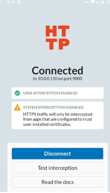

# Introduction

Recently worked on analyzing an Android app that's written with Xamarin framework. This post is to document what I learned from this process. If you are not familiar with Xamarin, from [Wikipedia](https://en.wikipedia.org/wiki/Xamarin), "Xamarin is a Microsoft-owned subsidiary that develops tools and libraries for building apps with C# across multiple platforms." And according to [Microsoft](https://dotnet.microsoft.com/en-us/apps/xamarin), Xamarin support ends May 1 2024. Developers are recommended to migrate to .NET Multi-platform App UI (.NET MAUI).

# Initial analysis
I had apk file of the mobile app. Apk file is nothing more than a zip. A quick unzip will extract file contents out.
```javascript
unzip xamapp.apk
```
After unzipping, besides the usual AndroidManifest.xml, classes.dex, assets, lib, etc, that you will find in an android app, there is a folder called "assemblies" that caught my attention. Inside the folder are a number of dll files.
From google search and Xamarin documentation, these dll files contain the main logic of the mobile app. 

# DLL Handling/Deobfuscation to Get Code
## Decompress
The first thing to do with these dll files is to decompress them with the script provided at https://github.com/NickstaDB/xamarin-decompress. I used the following batch processing script in Windows to decompress all the dll files in place.
```bash
@echo off
set "folder=.\assemblies"
set "program=python decompress.py"

for %%f in ("%folder%\*.dll") do (
  echo Processing %%f
  %program% -o "%%f"
)

echo Done.
```
## Deobfuscation
Tried to open up the dlls with ILSpy or dnSpy, didn't get meaningful code. A quick run of [de4dot](https://github.com/de4dot/de4dot) confirms they are obfuscated. Although de4dot is an archived project, it is still the best tool for checking obfuscation and trying deobfuscation. I run de4dot against the folder that contains the decompressed dlls and was able to deobfuscate successfully. Note, for best deobfuscation result, deobfuscate the whole folder at the same time.
```bash
de4dot -r .\assemblies -ru -ro .\out
```
A side node: google search found Kant did some update on de4dot at a cloned [repo](https://github.com/kant2002/de4dot). I used original de4dot.
What's left is just read the .net code and understand app logic.
## Traffic Interception
A big part of mobile app analysis is traffic analysis. Due to some technical checks, app doesn't run under emulator. So I have to try my luck with a non-rootable android phone.
Web search led me to [HTTP Toolkit]. Setup is pretty easy, install http toolkit app on google through play store, and install HTTP Toolkit on laptop.
Enable usb debugging on Android devices.
Upon launching HTTP Toolkit on laptop, choose "Android Device via ADB". Follow instructions to install CA certificate on android phone. You will see HTTP Toolkit on Android phone show as connected (picture cropped from HTTP Toolkit document).



As my phone is not rooted, there is no way to enable "System interception". Luckily it turned out not necessaryfor the app I was analyzing

However, when I check the traffic, traffic for the app shown as "server certificate not trusted". Either it doesn't trust "user certificates", which means I won't be able to intercept its traffic without a rooted phone; or it implements certificate pinning. 

[apk-mitm](https://github.com/niklashigi/apk-mitm) is a tool that does automatical removal of common certificate pinnings, so I decided to give it a try. After run apk-mitm against the apk file, push modified apk file to the android device and reinstall the apk file, I run HTTP Toolkit interception again and viola, it works this time, I can see the traffic from the mobile app in HTTP Toolkit window.


